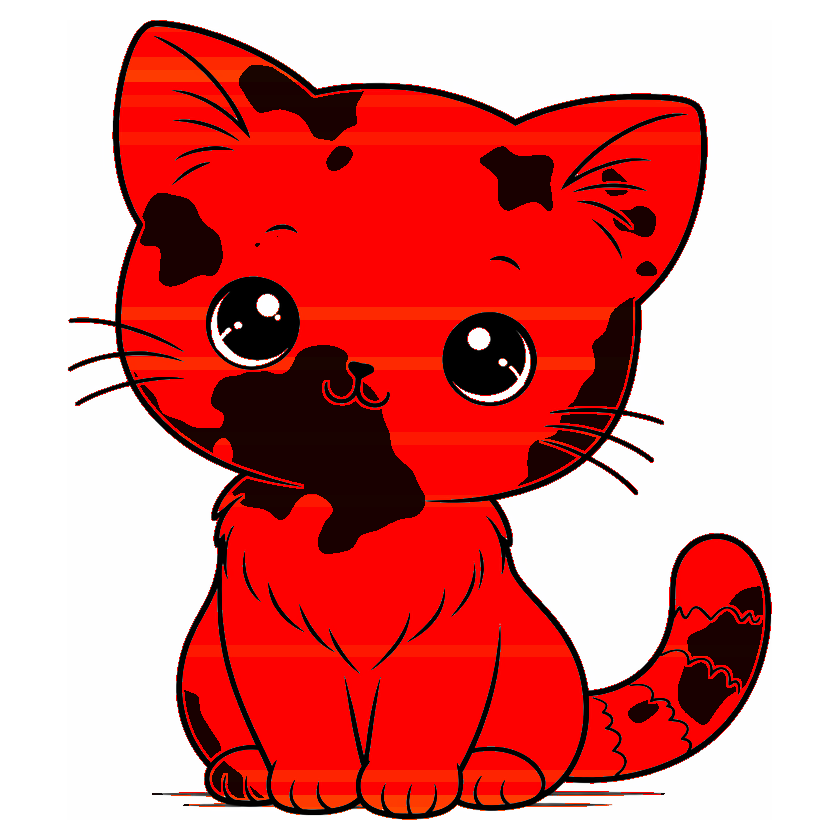
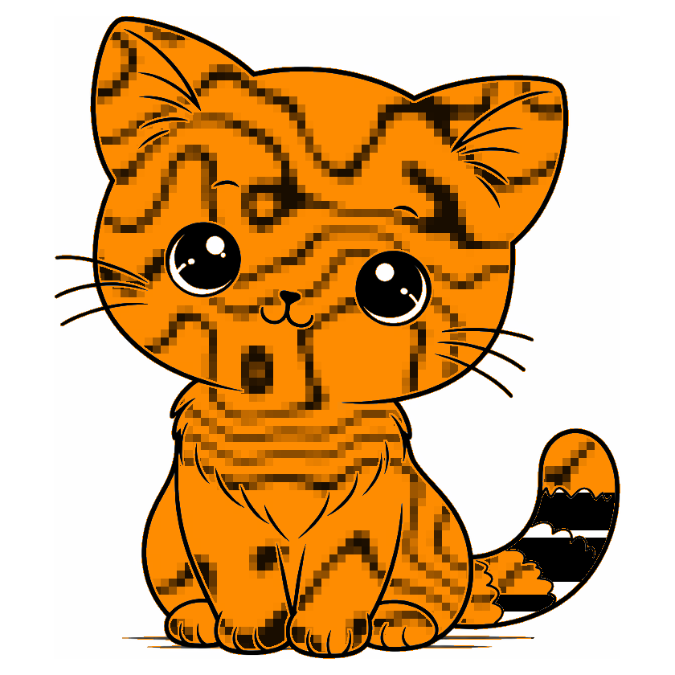
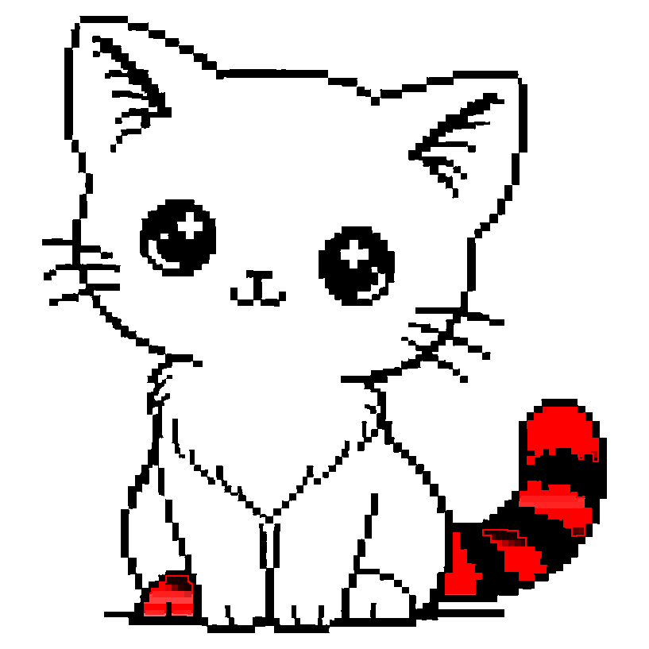

# excat

Generate a unique signature cat image for any ExLlama quantized model. Each cat is a visual fingerprint of the quantization profile -- sliced into horizontal bands (one per model layer) and tinted based on the average bits-per-weight of that layer. A deterministic fur pattern is generated from the model name, giving each model its own unique look.

| Qwen 2.1bpw | Ministral 4bpw, pixelized | Qwen 2.1bpw, pixcat + pixelized | Ministral 4bpw, pixcat |
|:---:|:---:|:---:|:---:|
|  |  |  |  |

## Color Scheme

Each horizontal slice of the cat corresponds to a model layer, tinted by its average bits-per-weight. 4bpw is neutral white, 2bpw runs red hot, and 8bpw goes black and cool. The background is transparent.

## Fur Patterns

The model name is hashed to deterministically generate a unique fur pattern. The hash controls the pattern type, scale, angle, density, and other parameters -- so the same model name always produces the same cat.

| Pattern | Description |
|---------|-------------|
| Mackerel tabby | Wavy parallel stripes |
| Classic tabby | Swirly, organic splotches |
| Splotches | Large irregular patches |
| Spotted | Scattered round spots |

## Usage

```
python excat.py <quantization_config.json> [-n model_name] [-i image] [-p pixel_size] [-d radius] [-o output.png]
```

**Arguments:**
- `config` -- Path to an ExLlama `quantization_config.json`
- `-n, --name` -- Model name for fur pattern generation (will prompt if not provided)
- `-i, --image` -- Built-in style name (`cat`, `pixcat`) or path to a custom image (default: `cat`)
- `-o, --output` -- Output path (default: `excat_<config_name>.png`)
- `-p, --pixelize` -- Pixelize the fur with given block size (e.g. `-p 10`). Off by default
- `-d, --detail-radius` -- Buffer zone in pixels around outlines where fur markings won't appear (default: 2)
- `-b, --border` -- Border padding in pixels (default: 20)

**Requirements:** Python 3, Pillow

```
pip install Pillow
```

## How It Works

1. Parses the quantization config and computes the average bpw per layer
2. Hashes the model name to derive fur pattern parameters
3. Crops the base cat image and squares it with a white border
4. Detects background and eye whites via flood-fill so only the cat interior is colored
5. Builds a detail buffer around outlines to protect facial features from fur markings
6. Slices the cat into horizontal bands (one per layer) and tints each based on its bpw
7. Overlays the fur pattern as black markings on the tinted interior
8. Optionally pixelizes the interior for a retro look
