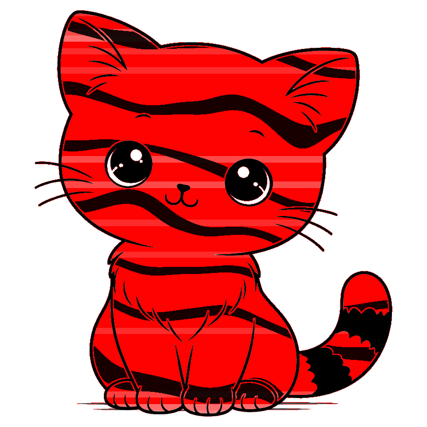
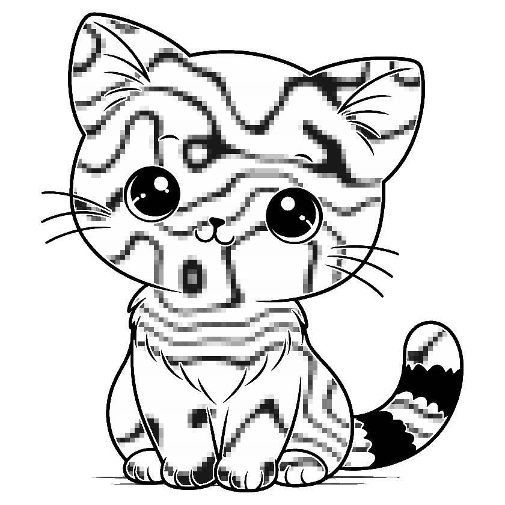
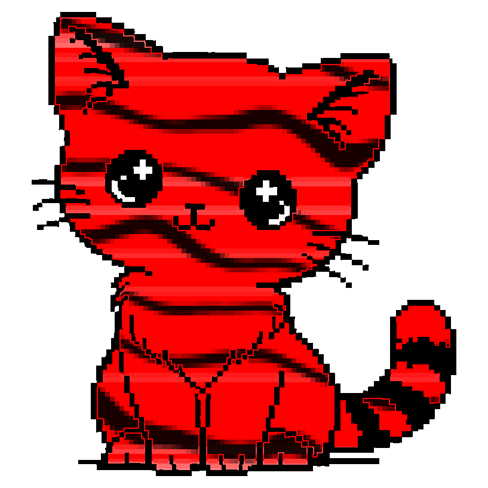
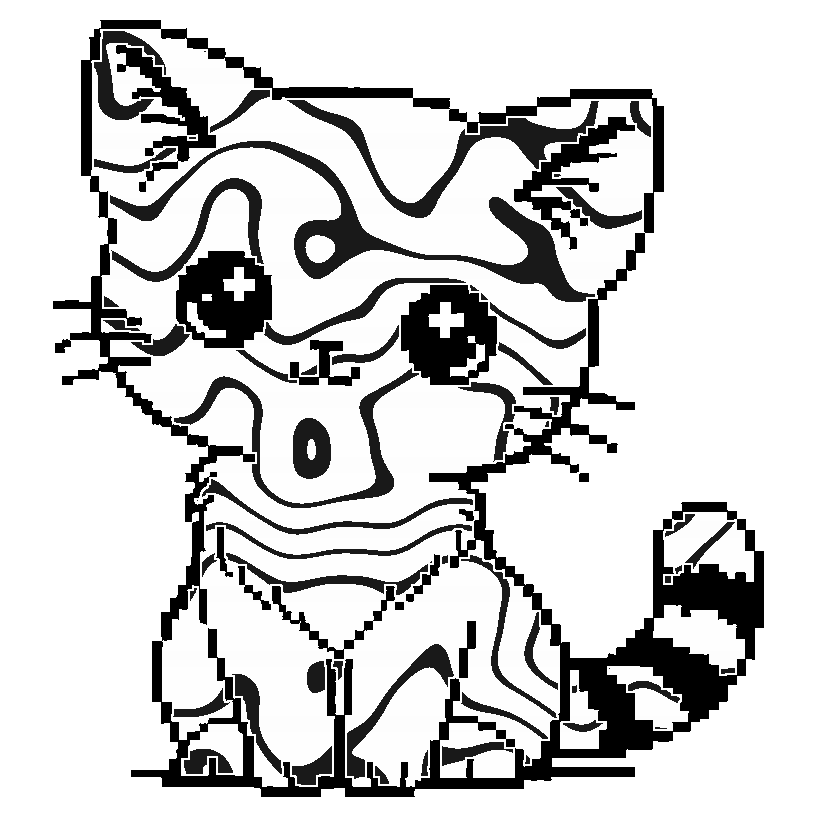

# excat

Generate a unique signature cat image for any ExLlama quantized model. Each cat is a visual fingerprint of the quantization profile -- sliced into horizontal bands (one per model layer) and tinted based on the average bits-per-weight of that layer. A deterministic fur pattern is generated from the model name, giving each model its own unique look.

<p align="center">
  
  
  
  
</p>

## Color Scheme

Each horizontal slice of the cat corresponds to a model layer, tinted by its average bits-per-weight:

| bpw | Color | Meaning |
|-----|-------|---------|
| 2 | Red | Heavily quantized |
| 4 | White | Neutral setpoint |
| 8 | Dark grey-purple | High fidelity |
| 16 | Gold | Unquantized |

Embedding and head layers are included as the first and last bands. The background is transparent.

## Fur Patterns

The model name is hashed to deterministically generate a unique fur pattern. Two hashes are used: the model family (everything up to the first dash) is hashed to determine the pattern type, so all models in the same family share the same pattern style. The full model name is then hashed separately to derive the remaining parameters (scale, angle, density, etc.) -- so the same model name always produces the same cat.

| Pattern | Description |
|---------|-------------|
| Mackerel tabby | Wavy parallel stripes |
| Classic tabby | Swirly, organic splotches |
| Splotches | Large irregular patches |
| Spotted | Scattered round spots |

## Usage

```
python excat.py <config> <name> [options]
```

**Required:**
- `config` -- Path to an ExLlama `quantization_config.json`
- `name` -- Model name (used to generate the fur pattern)

**Optional:**
- `-i, --image` -- Built-in style name (`cat`, `pixcat`) or path to a custom image (default: `pixcat`)
- `-o, --output` -- Output path (default: `excat_<config_name>.png`)
- `-p, --pixelize` -- Pixelize the fur with block size (default: `5`). `0` = off
- `-d, --detail-radius` -- Fade zone in pixels around outlines where fur markings taper off (default: `6`)
- `-b, --border` -- Border padding in pixels (default: `20`)

**Requirements:** Python 3, Pillow

```
pip install Pillow
```

## How It Works

1. Parses the quantization config and computes the average bpw per layer, including embedding and head layers
2. Hashes the model family name (up to the first dash) to pick the pattern type, then hashes the full model name to derive the remaining pattern parameters
3. Crops the base cat image and squares it with a white border
4. Detects background and eye whites via flood-fill so only the cat interior is colored
5. Builds a distance-based detail buffer around outlines so fur markings fade out smoothly near facial features
6. Slices the cat into horizontal bands (one per layer) and tints each based on its bpw
7. Overlays the fur pattern as black markings on the tinted interior, fading near outlines
8. Pixelizes the interior for a chunky pixel-art look (configurable, on by default)
