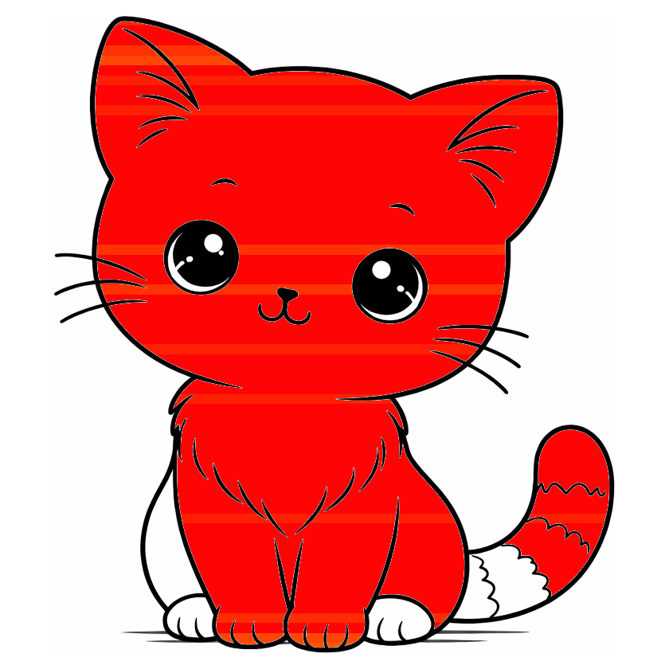

# excat

Generate a unique signature cat image for any ExLlama quantized model. Each cat is a visual fingerprint of the quantization profile -- sliced into horizontal bands (one per model layer) and tinted based on the average bits-per-weight of that layer.



## Color Scheme

The color gradient is asymmetric, reflecting the fact that quality loss is more dramatic at lower bit depths:

| bpw | Color | Meaning |
|-----|-------|---------|
| 2 | Red | Heavily quantized |
| 4 | Orange | Neutral setpoint |
| 8 | Yellow | High fidelity |

The gradient from 2-4 bpw (red to orange) is steeper than 4-8 bpw (orange to yellow), making aggressive low-bit quantization visually louder.

## Usage

```
python excat.py <quantization_config.json> [-c cat.png] [-o output.png] [-b border]
```

**Arguments:**
- `config` -- Path to an ExLlama `quantization_config.json`
- `-c, --cat` -- Base cat image (default: `cat.png`)
- `-o, --output` -- Output path (default: `excat_<config_name>.png`)
- `-b, --border` -- Border padding in pixels (default: 20)

**Requirements:** Python 3, Pillow

```
pip install Pillow
```

## How It Works

1. Parses the quantization config and computes the average bpw per layer
2. Crops the base cat image and squares it with a white border
3. Detects background and eye whites via flood-fill so only the cat interior is colored
4. Slices the cat into horizontal bands (one per layer) and tints each based on its bpw
